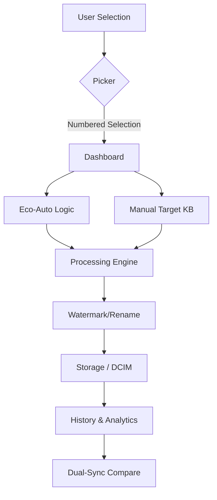

# ✨ MediaShrinker v10.0 ✨
**The Ultimate Minimalist Media Suite for Android**

*Compress · Organize · Clean · Create*

---

MediaShrinker is a professional-grade Android utility designed for users who value both **power** and **aesthetic**. It isn't just an image compressor; it's a complete toolkit to reclaim storage and manage your media with pixel-perfect precision.

## 💎 The Premium Experience

### 🎨 Aesthetic Onyx Design
Forget messy blue gradients. MediaShrinker features a deep **Onyx & Emerald** minimalist theme designed for eye comfort and high-end feel. 
- **Liquid Glass UI**: Frosted, semi-transparent buttons inspired by iOS control centers.
- **Micro-Animations**: Every touch feels tactile with our custom **Squeeze** (0.92x scale) and **Water Splash** ripple effects.
- **Smart UX**: Features like the **Bouncing Scroll Hint** and **File Missing Detection** ensure a smooth, error-free experience.

---

## 🚀 Core Features

### 1. ✨ Intelligence: Eco-Auto Mode
Don't guess quality settings. Tap **Eco** and let the app's local algorithm analyze your photo's resolution. It automatically finds the "Sweet Spot"—the perfect balance between maximum space saving and zero visible quality loss.

### 2. 🗜️ Precision: Target KB Compression
Need a photo under exactly 200KB for an upload? Our high-accuracy binary search engine hits your target size with professional reliability. 
- **Batch Processing**: Select up to **100 photos** and shrink them all in one go.
- **Smart Selection**: The gallery uses **Sequential Numbering** (1, 2, 3...) so you always know your order.

### 3. 🔍 Discovery: Big File Hunter
Stop hunting through folders. The **Hunter** scans your gallery for photos larger than your custom threshold (1MB, 5MB, 50MB+). Find the storage-hogs and reclaim GBs of space in seconds.

### 4. 🪄 Utility: Magic Cleaner
Built-in **Perceptual Hashing** technology identifies duplicate photos or similar burst shots. Review them in a professional grouped list and wipe away the clutter.

### 5. ⚖️ Accuracy: Dual-Sync Compare
Our Compare screen features **Magic Mirror** synchronization. Pinch-to-zoom or pan on the "Before" photo, and the "After" photo mirrors it perfectly. Pixel-peep your results with total confidence.

### 6. 🖼️ Advanced Processing
- **Custom Watermarking**: Protect your work by stamping your name or handle directly onto the media.
- **Smart Rename**: Use patterns like `Trip_{n}` to save batches sequentially.
- **Filename Prompt**: A professional naming screen before every task (toggleable in Settings).

---

## 🛠️ App Architecture

---

## ⚙️ Technical Details

| Category | Technology |
| :--- | :--- |
| **Language** | 100% Kotlin |
| **Minimum SDK** | API 26 (Android 8.0) |
| **Target SDK** | API 33 (Android 13) |
| **Concurrency** | Kotlin Coroutines (Background Processing) |
| **Algorithms** | Perceptual Hashing (Cleaner), Binary Search (Compressor) |
| **UI Framework** | Modern XML with Material 3 Principles |

---

## 📁 Folder Locations

- **Compressed Images**: `Gallery → DCIM/MediaShrinker`
- **PDF Documents**: `Files → Documents/MediaShrinker`

---

## ❤️ Support the Project

MediaShrinker is completely **free and ad-free**. I am working constantly to bring it to the Google Play Store. If you value this tool, consider supporting development via the in-app **"Buy Me A Coffee"** option. Every donation helps keep the app private and offline-capable.

---

## 📬 Contact & Support

**Developer**: Aaditya Shukla  
**Instagram**: [@carryon.aditya](https://www.instagram.com/carryon.aditya)  
**Discord**: `rawxtreme`  

*Found a bug? Use the built-in **Troubleshooting Report** in Settings for a direct line to the developer.*
